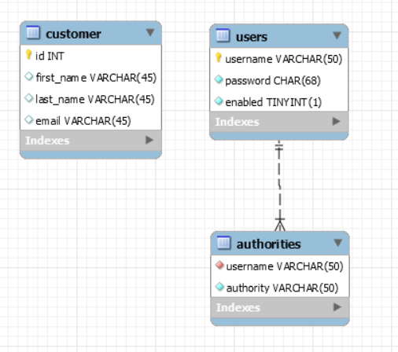
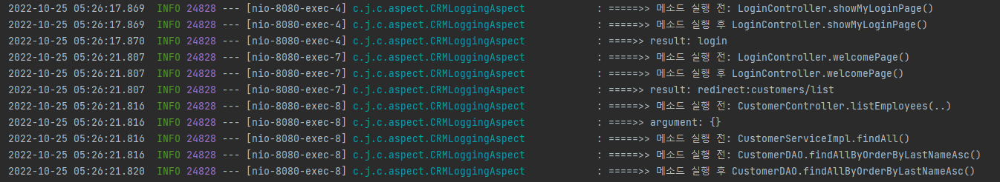
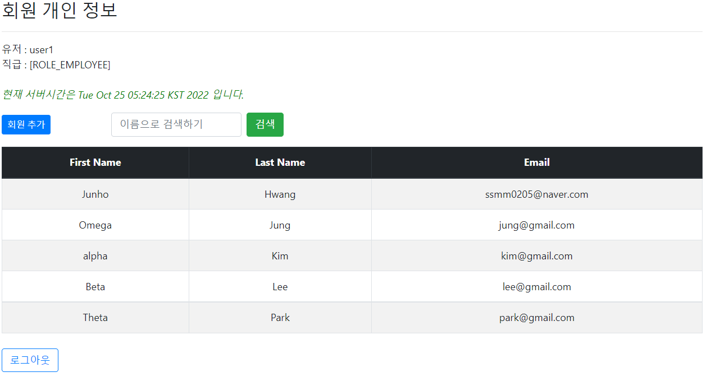
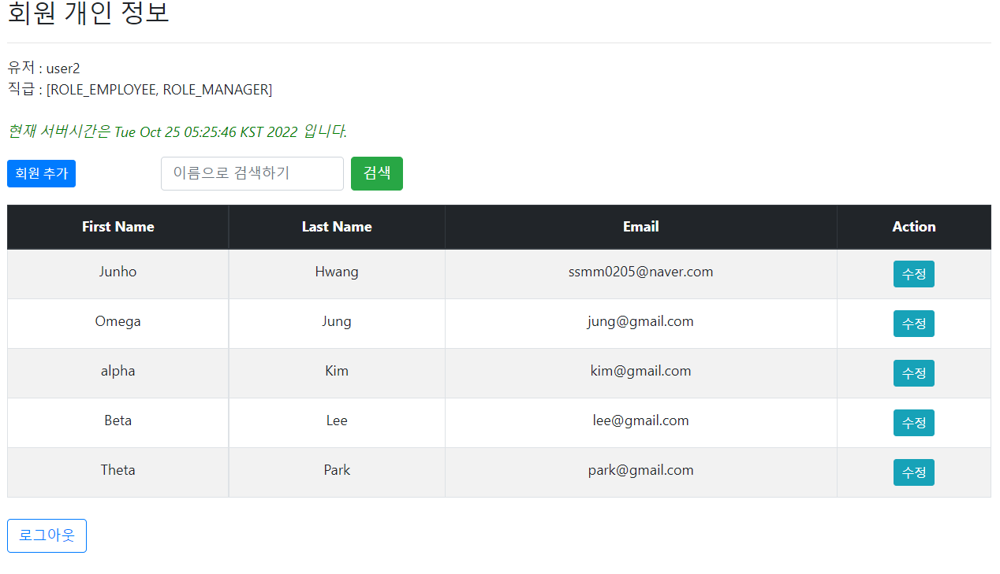
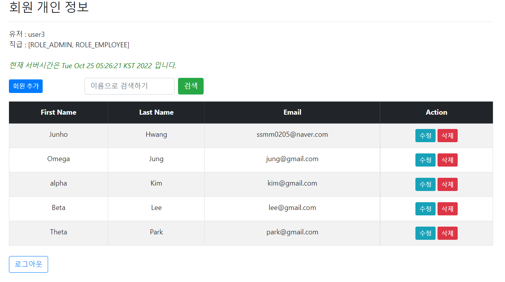
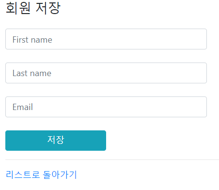

# :pushpin: Customer-relationship-tracker (CRM)
> 회원 개인 정보 관리 페이지

## 1. 제작 기간 & 참여 인원
- 2022년 10월
- 개인 프로젝트 (유데미를 스프링 강의 학습의 연장선)

## 2. 사용 기술
#### `Back-end`
  - Java 11, Spring Boot 2.7.5, Gradle, Spring Data JPA, Spring Security,
    MySQL, Thymeleaf, Lombok, Devtools

#### `Front-end`
  - udemy 학습시 예제로 사용했던 템플릿 수정.

## 3. ERD 설계

데이터베이스 설계 지식이 부족하여 복잡하지 않은 두 테이블로 만들 수 있는 것이 어떤것이 있을까 생각하다
회원 개인 정보 관리 페이지를 만들기로 했습니다.

## 4. 핵심 기능
이 서비스의 핵심 기능은 회원을 등록하고, 권한에 따라 회원의 정보를 삭제하고 변경할 수 있는것 입니다.

<b>핵심 기능 설명 펼치기</b>

### 4.1. Spring Data JPA를 통해 이름을 Last Name에 오름차순으로 정렬하고, 검색하는 기능
 - 아래 4.3 캡쳐한 목록을 보시면 리스트가 Last Name을 기준으로 오름차순 정렬되어 있습니다.
### 4.2. Spring AOP를 통한 로그 기록
 - 학습한 Spring AOP를 적용시켜 보고자 하였고 다음과 같이 메소드 호출 전 후로 로그를 남기는 기능을 구현 하였습니다. 

### 4.3 회원 개인 정보 수정과 삭제 기능에 대하여 권한 부여- 비밀번호 : fun123
- user1로 로그인 시 (읽기만 가능) 
- user2로 로그인 시 (회원 추가 및 수정 가능)

- user3로 로그인 시 (회원 추가, 수정, 삭제 모두 가능)

위에서 확인 할 수 있듯, 각 기능의 권한 범위를 Spring Security를 통해 부여하는 기능을 구현해 보았습니다.
### 4.4 회원 추가, 삭제, 수정하는 기본적인 CRUD

- Spring Data JPA를 통해 회원 저장을 하면 DB에 추가되며 회원 개인 정보 변경과 삭제도 가능합니다.

### 4.5 로그인과 로그아웃 기능
- 회원 개인 정보 접근 시 권한 확인을 위해 로그인 기능과 로그아웃 기능을 Spring Security를 통해 구현하였습니다.

## 5. 트러블 슈팅
### 5.1. WebSecurityConfigurerAdapter 문제
- 2022년 5월 16일부터 Spring Security 5.7이 출시되어 WebSecurityConfigurerAdapter가 DEPRECATED 되었기 때문에, 학습했던 방식과 
다른 방식으로 구현을 해야 했습니다. WebSecurityConfigurerAdapter을 사용하지 않은 udemy에서 배운 내용을 리펙토링 하기 위해 여러 사이트와 Spring 공식 문서를 찾아 보았습니다.
### 5.2. @RequiredArgsConstructor 사용시 주의할 점
 - 이번 프로젝트는 두 개의 데이터베이스를 이용하기에 서로다른 datasource를 지정해 주어야 했습니다.
   DemoSecurityConfig 클래스에서 @Qualifier를 통해 Spring Security에 해당하는 datasource를 지정해주는데, 이때 @RequiredArgsConstructor를 통해 의존성 주입이 안되는 것을 확인하였습니다.
 
## 6. 나아가야할 방향
 
> 트러블 슈팅 경험을 통해 롬복의 작동원리에 대해 학습해 제대로 알고 써야 겠다는 생각이 들었습니다.  
 또한 회원을 이름순 으로 정렬하고 검색하는 기능시 Data JPA가 아닌 Query DSL을 학습해 직접 구현해 볼 예정입니다.  
> 데이터베이스 설계 하는 방식을 학습해 더 규모가 크고 복잡한 프로젝트를 진행하도록 할 것이며  
> 작동이 안되는 여러 경우를 마주치면서, 테스트의 중요성을 느꼈고 테스트 주도 개발 방식을 학습해 TDD 방식으로 프로젝트를 진행해 나갈 예정입니다.
  
